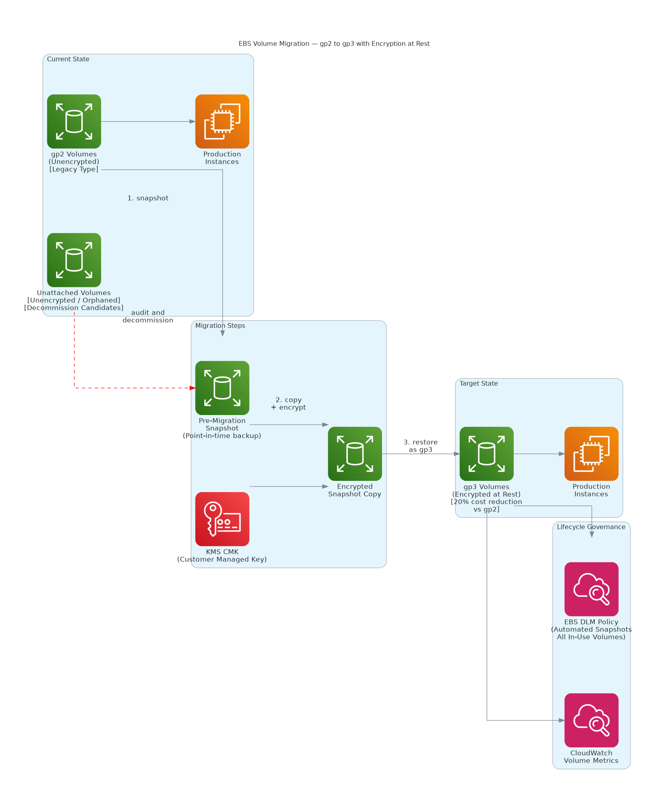

# EBS Encryption & gp2 → gp3 Migration

Remediation of unencrypted EBS volumes and legacy gp2 storage across an AWS environment, covering encryption enablement, storage class upgrade to gp3, and cleanup of unattached volumes.

---

## Overview

This project documents EBS storage posture remediation across an AWS environment where all attached volumes were unencrypted and the majority were on the older gp2 storage type.

Scope:
- Encrypting all EBS volumes (attached and unattached)
- Migrating from gp2 to gp3 for cost and performance improvements
- Identifying and cleaning up unattached volumes

---

## Storage Inventory (Before)

| Finding | Count |
|---|---|
| Total EBS volumes | 46 |
| Unencrypted volumes | 46 (100%) |
| gp2 volumes | 44 |
| Unattached volumes | 5 |

---

## Why gp3?

| Attribute | gp2 | gp3 |
|---|---|---|
| Baseline IOPS | 3 IOPS/GB (burstable) | 3,000 IOPS (fixed) |
| Max throughput | 250 MB/s | 1,000 MB/s |
| Cost | Baseline | ~20% cheaper |

gp3 is AWS's current recommended general-purpose SSD. For most workloads, migrating from gp2 to gp3 is free performance and cost reduction with zero downtime.

---

## Encryption Approach

EBS volumes cannot be encrypted in-place. The process per volume:

```bash
# 1. Create snapshot of existing volume
aws ec2 create-snapshot \
  --volume-id <volume-id> \
  --description "Pre-encryption snapshot"

# 2. Copy snapshot with encryption enabled
aws ec2 copy-snapshot \
  --source-region us-east-1 \
  --source-snapshot-id <snapshot-id> \
  --encrypted --kms-key-id alias/aws/ebs

# 3. Create new encrypted gp3 volume from encrypted snapshot
aws ec2 create-volume \
  --snapshot-id <encrypted-snapshot-id> \
  --volume-type gp3 --encrypted \
  --availability-zone us-east-1a

# 4. Detach old volume, attach new encrypted volume
aws ec2 detach-volume --volume-id <old-volume-id>
aws ec2 attach-volume \
  --volume-id <new-volume-id> \
  --instance-id <instance-id> --device /dev/xvda
```

---

## gp2 → gp3 Upgrade (No Downtime)

```bash
# Modify volume type live, no downtime required
aws ec2 modify-volume \
  --volume-id <volume-id> --volume-type gp3

# Monitor modification progress
aws ec2 describe-volumes-modifications \
  --volume-ids <volume-id> \
  --query 'VolumesModifications[*].{Status:ModificationState,Progress:Progress}'
```

---

## Enable Encryption by Default

```bash
# Enforce encryption for all new EBS volumes going forward
aws ec2 enable-ebs-encryption-by-default
aws ec2 get-ebs-encryption-by-default
```

---

## Repository Structure

```
ebs-encryption-migration/
├── README.md
├── findings/
│   └── volume-inventory.md
├── change-records/
│   ├── CR-ebs-default-encryption.md
│   ├── CR-gp2-to-gp3-migration.md
│   └── CR-unattached-volume-cleanup.md
└── scripts/
    ├── audit-ebs-volumes.sh
    ├── encrypt-volume.sh
    └── upgrade-gp2-to-gp3.sh
```

---

## Tech Stack

- AWS EC2, EBS, KMS, AWS CLI
- Bash

> All volume IDs, instance IDs, and ARNs have been sanitized.

---

## Execution Results: gp2 → gp3 Migration

The gp2 to gp3 migration was executed live across the environment in a single session with zero downtime, as part of a broader cost optimisation effort.

| Metric | Value |
|---|---|
| Volumes migrated (gp2 → gp3) | 26 |
| Total storage migrated | 668 GB |
| Migration method | Live `modify-volume`, no restart |
| Production downtime | None |
| Monthly storage saving | ~$13 |
| Annual storage saving | ~$156 |

Key points from execution:

- All volumes were modified live using `modify-volume`. gp3 conversion does not require detaching the volume or restarting the instance, so there was no service interruption.
- A 6-hour AWS cooldown applies between volume modifications, which was factored into the rollback plan.
- Two orphaned, unattached volumes (250 GB combined) were snapshotted and deleted in the same effort, removing ongoing storage charges for resources no longer in use.

### Orphaned Volume Cleanup

```bash
# Identify unattached (available) volumes
aws ec2 describe-volumes \
  --filters Name=status,Values=available \
  --query 'Volumes[*].{ID:VolumeId,Size:Size,AZ:AvailabilityZone}' \
  --output table

# Snapshot before deletion (safety net)
aws ec2 create-snapshot \
  --volume-id <volume-id> \
  --description "Pre-deletion snapshot of orphaned volume"

# Delete once snapshot confirmed complete
aws ec2 delete-volume --volume-id <volume-id>
```

---

## Architecture Diagram



